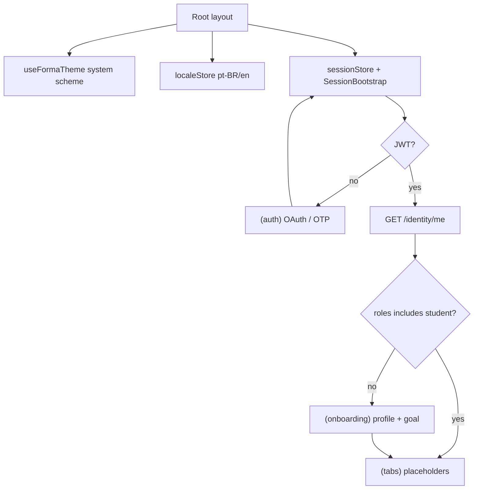

# Mobile Foundation Design

**Spec**: `.specs/features/mobile-foundation/spec.md`  
**Status**: Approved  
**Approach**: A (recommended) — Expo Router + Protected routes + thin session/API layer

---

## Architecture approach (chosen)

| | A — Thin shell ⭐ | B — Domain modules early | C — Heavy global store |
|--|-------------------|--------------------------|------------------------|
| Idea | Expo Router file routes, Zustand stores (`sessionStore`, `localeStore`), wired `api` client, `useFormaTheme()`; features stay in route folders | Same + `src/features/{auth,onboarding}/` modules with hooks/repos | Redux or heavy global store |
| Pros | Matches Expo SDK 53 docs; low ceremony; slices plug into tabs | Clear boundaries for later slices | Centralized state |
| Cons | Feature folders grow organically | Slight over-structure for Slice 0 | Extra indirection for few screens |
| Fit | AD-001 spirit (simple) + AD-023 clean scaffold | Fine later if screens explode | Reject for MVP |

**Decision:** Approach **A**. Later slices may introduce `src/features/[slice]/` when a domain owns >2 screens — not required in Slice 0.



---

## Code Reuse Analysis

### Existing Components to Leverage

| Component | Location | How to Use |
|-----------|----------|------------|
| Shared enums | `packages/types` (`HealthGoal`, `Role`, …) | Import in onboarding forms + me gate |
| API contracts | Nest controllers under `apps/api/src/modules/identity|student` | Mirror paths/DTOs in mobile `api/` |
| Design tokens intent | `DESIGN.md`, `.specs/ui/RULES.md`, apple-fitness expo companion | Implement **new** `src/theme/` — do **not** revive deleted prototype |
| Monorepo workspace | `pnpm-workspace.yaml` `apps/*` | Add `apps/mobile` package |
| Lint/format | root Biome | Include mobile sources in biome scope |

### Integration Points

| System | Integration Method |
|--------|-------------------|
| Forma REST API | `EXPO_PUBLIC_API_URL` + fetch wrapper; Bearer JWT; `Accept-Language` |
| Identity OTP | `POST /api/identity/otp/request`, `POST /api/identity/otp/verify` |
| Identity OAuth | Browser/`AuthSession` → `GET /api/identity/oauth/:provider` → callback; **mobile handoff see Risks** |
| Identity me | `GET /api/identity/me` → `{ id, email, roles }` — `student` in `roles` ⇒ skip onboarding |
| Student profile/goal | `POST /api/student/profile`, `PUT /api/student/goal` |

---

## Components

### `apps/mobile` package (Expo)

- **Purpose**: Student mobile client workspace package
- **Location**: `apps/mobile/`
- **Stack**: Expo SDK **53+** (Protected routes), expo-router, TypeScript, expo-secure-store, expo-localization, i18n-js or expo-i18n pattern, react-native-reanimated (peer for later rings), react-native-safe-area-context
- **Scripts**: `start`, `ios`, `android`, `lint`/`check-types` wired into turbo where sensible
- **Reuses**: Turborepo/`pnpm` workspace; `@forma/types`

### Theme system

- **Purpose**: Light/dark tokens + brand colors from `DESIGN.md`
- **Location**: `apps/mobile/src/theme/`
  - `colors.ts` — dark + light palettes; rings/brand invariant
  - `typography.ts` — SF Pro / Inter fallback; tabular nums
  - `useFormaTheme.ts` — follows system appearance via `useColorScheme`; no Context
- **Interfaces**:
  - `useFormaTheme(): { colors, typography, scheme }`
- **Rules**: Primary CTA always `#30D158`; Move pink never primary button
- **Light defaults** (feature-level; green unchanged):

| Role | Dark | Light |
|------|------|-------|
| canvas | `#000000` | `#F2F2F7` |
| grouped | `#1C1C1E` | `#FFFFFF` |
| raised | `#2C2C2E` | `#E5E5EA` |
| separator | `#38383A` | `#C6C6C8` |
| label primary | `#FFFFFF` | `#000000` |
| label secondary | white@60% | black@60% |
| label tertiary | white@30% | black@30% |

### i18n

- **Purpose**: pt-BR default + en catalogs for Slice 0 strings
- **Location**: `apps/mobile/src/i18n/` (`pt-BR.ts`, `en.ts`, `index.ts`)
- **Interfaces**:
  - `t(key, params?): string`
  - `setLocale('pt-BR' \| 'en')` / `useLocale()`
- **Dependencies**: Device locale via expo-localization; fallback `pt-BR`
- **API**: Session/API client reads locale for `Accept-Language`

### Session + API client

- **Purpose**: Persist JWT, attach headers, clear on 401
- **Location**: `apps/mobile/src/session/`, `apps/mobile/src/api/`
- **Interfaces**:
  - `sessionStore` + `useSession(): { token, user, isLoading, signIn(token), signOut(), refreshMe() }`; `SessionBootstrap` restores JWT on mount
  - `localeStore` + `useLocale()`; `getActiveLocale()` for non-React modules
  - `api.request<T>(path, init): Promise<T>` — base URL, Bearer, Accept-Language; on 401 → `sessionStore.signOut()` via `wireApiStores`
  - Domain helpers: `identity.requestOtp`, `identity.verifyOtp`, `identity.me`, `identity.startOAuth`, `student.createProfile`, `student.setGoal`
- **Storage**: `expo-secure-store` (native); web fallback only if needed later
- **Reuses**: None in repo — new thin layer (no axios required unless preferred; prefer `fetch`)

### Navigation shell

- **Purpose**: Auth vs onboarding vs tabs via Expo Router Protected routes
- **Location**: `apps/mobile/app/`
  - `app/_layout.tsx` — providers + root Stack + `Stack.Protected`
  - `app/(auth)/` — welcome/sign-in, otp, oauth result
  - `app/(onboarding)/` — profile, goal
  - `app/(tabs)/` — home | training | nutrition | progress placeholders + optional account/logout entry
- **Guards**:
  - `(auth)` when `!token`
  - `(onboarding)` when `token && !roles.includes('student')`
  - `(tabs)` when `token && roles.includes('student')`
- **Active tab tint**: `#30D158`

### UI primitives (Slice 0 only)

- **Purpose**: Minimal shared chrome so Auth/Onboarding match design rules
- **Location**: `apps/mobile/src/ui/`
  - `PrimaryButton`, `TextField`, `Screen`, `InlineError`, `LoadingState`
- **Do not build** rings/MetricTile here (Slice 1)

### Auth screens

- **Purpose**: OAuth buttons + email OTP request/verify
- **Location**: `app/(auth)/`
- **States**: loading, validation empty, API error, 429 rate limit
- **OAuth**: `expo-auth-session` / `WebBrowser.openAuthSessionAsync` against API start URL; see Risks for token handoff

### Onboarding screens

- **Purpose**: Collect profile DTO fields + `HealthGoal` enum
- **Location**: `app/(onboarding)/`
- **Flow**: Profile form → Goal picker → `refreshMe()` → tabs
- **Partial failure**: if profile succeeds and goal fails, stay on goal with error + retry (do not re-collect profile unless API requires)

---

## Data Models

### Session user (client)

```typescript
interface SessionUser {
  id: string
  email: string
  roles: Array<'student' | 'trainer' | 'nutritionist'>
}
```

**Source**: `GET /api/identity/me`. Onboarding complete iff `roles` includes `student`.

### Profile form

```typescript
interface StudentProfileInput {
  age: number        // 13–120
  sex: 'male' | 'female' | 'other'
  heightCm: number   // 50–250
  activityLevel: 'sedentary' | 'light' | 'moderate' | 'active' | 'very_active'
}
```

### Goal form

```typescript
type HealthGoal = 'lose_weight' | 'gain_muscle' | 'maintain' | 'improve_health'
```

---

## Error Handling Strategy

| Error Scenario | Handling | User Impact |
|----------------|----------|-------------|
| Invalid email / empty OTP | Client validation | Inline field errors; no API call |
| OTP wrong/expired `401` | Show `t('auth.otpInvalid')` | Stay on OTP screen |
| OTP rate limit `429` | Show `t('auth.otpRateLimit')` | Stay; disable resend briefly optional |
| OAuth cancel / no token | Localized failure | Stay on Auth |
| Network down | Catch fetch errors | `t('errors.network')` + retry |
| Profile/goal `4xx` | Show API message if localized else generic | Retry on same step |
| Any protected `401` | Clear SecureStore + session | Redirect Auth via Protected guard |
| SecureStore read fail | Treat as logged out | Auth |
| Missing i18n key | Dev-time assert / fallback string logged | Must not ship raw keys (gate in Tasks) |

---

## Risks & Concerns

| Concern | Location | Impact | Mitigation |
|---------|----------|--------|------------|
| OAuth callback returns **JSON** `{ accessToken }`, not app deep link | `oauth.controller.ts` callback | Hard for `AuthSession` to harvest token in production browser flow | **Slice 0:** OTP is primary verified path; OAuth ships with **dev/mock**: open session against mock redirect chain and/or parse callback via controlled WebView **or** small API add-on: redirect `302` to `EXPO_PUBLIC_OAUTH_SUCCESS_URL?accessToken=` when `Accept: mobile` / query `platform=mobile`. Prefer minimal API redirect in same slice if OAuth P1 must work on device — task TBD in Tasks. |
| Google browser OAuth deprecated for Expo Go | Expo docs | Production Google may need native Google Sign-In later | Document; MVP: AuthSession + API providers; native Google as follow-up if broken in Go |
| `/me` has no explicit `hasStudentProfile` flag | `MeResponseDto` | Gate relies on `roles` | Use `Role.Student` in roles (API already derives from profile) |
| No mobile e2e harness | repo | Spec assumed smoke + types/lint | Tasks: TS + lint + manual/maestro-optional; do not invent Detox ceremony |
| Light theme hexes not in DESIGN.md | DESIGN.md dark-first | Inconsistency risk | Light table above locked in this design; append note to DESIGN.md in Execute if needed |
| Rest-day streak temptation | AD-027 | Scope creep | Explicitly out of Slice 0 |

---

## Tech Decisions (non-obvious)

| Decision | Choice | Rationale |
|----------|--------|-----------|
| Navigation auth model | Expo Router **Protected routes** (SDK 53+) | Current Expo recommended pattern |
| HTTP client | Thin `fetch` wrapper | No axios tax; easy 401 hook |
| State | **Zustand** (`src/stores/`) for session + locale + per-slice feature state (AD-030); theme via `useColorScheme` hook | No React Context for app state; no Redux |
| Onboarding gate | `roles.includes('student')` from `/me` | Matches API; no new endpoint |
| OAuth vs OTP priority for QA gate | OTP must pass Verifier; OAuth mock/dev path required, production deep-link handoff as explicit task | Unblocks Slice 0 without stalling on provider console setup |
| Package name | `@forma/mobile` | Aligns with `@forma/api`, `@forma/types` |
| Tests Slice 0 | `tsc` + biome + optional RTL smoke for pure utils | Integration against real API manual/dev |

### Project-level decisions to append on approval

| ID | Decision |
|----|----------|
| AD-028 | Mobile navigation = Expo Router Protected routes; session in SecureStore |
| AD-029 | Mobile talks to API via thin fetch client + `EXPO_PUBLIC_API_URL`; onboarding gate = `student` role from `/me` |
| AD-030 | Mobile client state = Zustand stores; theme = system scheme via `useFormaTheme()` |

---

## Folder sketch

```
apps/mobile/
  app/
    _layout.tsx
    (auth)/_layout.tsx
    (auth)/index.tsx          # sign-in
    (auth)/otp.tsx
    (onboarding)/_layout.tsx
    (onboarding)/profile.tsx
    (onboarding)/goal.tsx
    (tabs)/_layout.tsx
    (tabs)/index.tsx          # home placeholder
    (tabs)/training.tsx
    (tabs)/nutrition.tsx
    (tabs)/progress.tsx
  src/
    api/
    stores/
    session/
    theme/
    i18n/
    ui/
  package.json
  app.json
  tsconfig.json
```

---

## Success handoff for multi-agent

After Execute + Verifier PASS, update STATE Handoff with: branch, package path, how to run, env vars, auth entrypoints, and “Slice 1 starts at Home Summary inside `(tabs)/index`”. Next agent loads **only** `mobile-home-summary` spec + this design’s folder sketch + DESIGN/RULES — not full platform-foundation.
