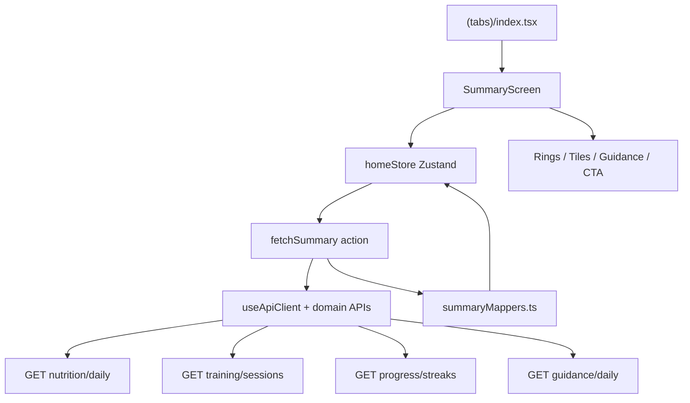

# Mobile Home Summary Design

**Spec**: `.specs/features/mobile-home-summary/spec.md`  
**Status**: Approved  
**Approach**: A (recommended) — Zustand feature store + pure mappers + composable Summary UI

---

## Architecture approach

| | A — Zustand store + mappers ⭐ | B — React Context + hook | C — Monolithic screen file |
|--|--------------------------------|--------------------------|----------------------------|
| Idea | `homeStore` (Zustand) owns fetch/status/models; pure `summaryMappers.ts`; presentational components; optional thin selector hooks | `HomeSummaryProvider` + `useHomeSummary` Context | All logic in `(tabs)/index.tsx` |
| Pros | Simple global-ish screen state; testable mappers; matches AD-030; scales to Slices 2–4 | Familiar RN pattern | Fast once |
| Cons | One more dep (`zustand`) | Context boilerplate; re-render pitfalls | Untestable blob |
| Fit | AD-030 + Slice 0 conventions | Reject — user chose Zustand over Context for feature state | Reject |

**Decision:** Approach **A** with **Zustand** (`homeStore`). No `HomeSummaryProvider` or other new React Context.



---

## Code Reuse Analysis

### Existing components to leverage

| Component | Location | How to use |
|-----------|----------|------------|
| `Screen` | `apps/mobile/src/ui/Screen.tsx` | Extend with optional `RefreshControl` on scroll variant |
| `PrimaryButton` | `apps/mobile/src/ui/PrimaryButton.tsx` | Summary CTA |
| `LoadingState` | `apps/mobile/src/ui/LoadingState.tsx` | First-load skeleton fallback |
| `InlineError` | `apps/mobile/src/ui/InlineError.tsx` | Per-section / full-screen errors |
| `useFormaTheme` | `apps/mobile/src/theme/` | Colors + typography |
| `useT` / i18n catalogs | `apps/mobile/src/i18n/` | All new copy keys `home.*`, extend `tabs.*` |
| `createApiClient` | `apps/mobile/src/api/client.ts` | Bearer + `Accept-Language` + 401 → signOut |
| Domain API pattern | `identity.ts`, `student.ts` | Mirror for nutrition/training/progress/guidance |
| `brand` / ring colors | `apps/mobile/src/theme/colors.ts` | Add `ringConfig` + track opacities |
| Tab layout | `apps/mobile/app/(tabs)/_layout.tsx` | Add icons + keep `tabBarActiveTintColor: colors.primary` |

### Integration points

| System | Integration method |
|--------|-------------------|
| Nutrition daily | `GET /api/nutrition/daily?date=YYYY-MM-DD` |
| Training sessions | `GET /api/training/sessions?page=1&limit=20` — filter `completedAt` UTC date |
| Progress streaks | `GET /api/progress/streaks` |
| Guidance | `GET /api/guidance/daily` — array of `{ type, message, priority }` |
| Navigation | `expo-router` `useRouter()` → `/(tabs)/training` \| `nutrition` \| `progress` |
| Session | `useSession()` for auth gate (tabs already protected by Slice 0) |

---

## New dependencies (Execute)

| Package | Why |
|---------|-----|
| `zustand` | Feature store for Home summary state (AD-030) |
| `react-native-svg` | Activity rings (per `.specs/ui/references/apple-fitness-DESIGN-expo.md`) |
| `react-native-reanimated` | Ring sweep animation; respect reduced motion |
| `@expo/vector-icons` | Tab bar icons (Ionicons SF-style glyphs) |

Install via `pnpm --filter @forma/mobile add zustand` and `npx expo install react-native-svg react-native-reanimated @expo/vector-icons` in Execute. Add Reanimated Babel plugin if not already present.

---

## Folder sketch

```
apps/mobile/
  app/(tabs)/
    index.tsx              # thin — renders <SummaryScreen />
    _layout.tsx            # tab icons + labels (P2 polish)
  src/
    api/
      useApiClient.ts      # shared hook — token + locale + 401
      nutrition.ts
      training.ts
      progress.ts
      guidance.ts
    features/home/
      SummaryScreen.tsx
      homeStore.ts           # Zustand — status, models, fetchSummary, refresh
      useHomeSummary.ts      # optional thin selectors over homeStore (no Context)
      summaryMappers.ts
      summaryMappers.test.ts
      ctaRouting.ts
      ctaRouting.test.ts
      types.ts
      components/
        SummaryHeader.tsx
        ActivityRings.tsx
        RingHeroCard.tsx
        MetricTile.tsx
        MetricTileGrid.tsx
        GuidanceList.tsx
        SummarySkeleton.tsx
    theme/
      colors.ts            # + ringConfig export
```

---

## Components

### `useApiClient`

- **Purpose**: Single authenticated API client for any screen (Home now; Training/Nutrition later).
- **Location**: `apps/mobile/src/api/useApiClient.ts`
- **Interfaces**:
  - `useApiClient(): ApiClient` — reads `useSession().signOut`, `getActiveLocale()`, token from `getAccessToken()` or session ref pattern
- **Dependencies**: `createApiClient`, `useSession`, `getActiveLocale`
- **Reuses**: `getWiredIdentityApi()` / `getWiredStudentApi()` via `wireApiStores` (reads `sessionStore` + `localeStore`)

> **Note:** Token/locale are read via `wireApiStores` getters (`useSessionStore.getState().token`) — no stale closures.

### Domain API modules

- **Purpose**: Typed wrappers for Home fetches.
- **Location**: `apps/mobile/src/api/{nutrition,training,progress,guidance}.ts`
- **Interfaces**:

```typescript
// nutrition.ts
type MacroTotals = { calories: number; protein: number; carbs: number; fat: number }
type DailySummary = { date: string; consumed: MacroTotals; target: MacroTotals | null }

createNutritionApi(api).getDailySummary(date: string): Promise<DailySummary>

// training.ts
type WorkoutSession = { id: string; completedAt: string; /* sets if needed */ }
type Paginated<T> = { items: T[]; page: number; limit: number; total: number }

createTrainingApi(api).listSessions(page?: number, limit?: number): Promise<Paginated<WorkoutSession>>

// progress.ts
type StreakPair = { current: number; longest: number }
type StreaksResponse = { training: StreakPair; nutrition: StreakPair }

createProgressApi(api).getStreaks(): Promise<StreaksResponse>

// guidance.ts
type GuidanceSuggestion = { type: string; message: string; priority: number }

createGuidanceApi(api).getDaily(): Promise<GuidanceSuggestion[]>
```

### `summaryMappers.ts` (pure — unit tested)

- **Purpose**: Map API payloads → ring progress, tile values, legend labels.
- **Location**: `apps/mobile/src/features/home/summaryMappers.ts`
- **Interfaces**:

```typescript
export function todayUtcDate(now = new Date()): string
// → now.toISOString().slice(0, 10)

export function computeMoveProgress(consumed: number, target: number | null): number
// → target && target > 0 ? min(consumed / target, 1) : 0

export function computeExerciseProgress(sessions: WorkoutSession[], today: string): number
// → 1 if any session completedAt slice === today else 0

export function computeStandProgress(consumed: MacroTotals): number
// → 1 if any macro > 0 else 0

export type RingLegend = { label: string; value: string; goal: string }
export function buildRingLegend(...): { move: RingLegend; exercise: RingLegend; stand: RingLegend }

export type TileModel = { id: string; labelKey: string; value: string; subValue?: string; accent?: 'award' | 'move' | 'exercise' | 'stand' }
export function buildMetricTiles(streaks, daily): TileModel[]
```

### `ctaRouting.ts` (pure — unit tested)

- **Purpose**: Derive CTA label key + tab href from guidance.
- **Location**: `apps/mobile/src/features/home/ctaRouting.ts`
- **Interfaces**:

```typescript
export type TabRoute = '/(tabs)/training' | '/(tabs)/nutrition' | '/(tabs)/progress'

export function resolveCtaFromGuidance(
  suggestions: GuidanceSuggestion[],
): { labelKey: string; route: TabRoute }
```

**Mapping (locked):**

| Top suggestion `type` | `labelKey` | `route` |
|-----------------------|------------|---------|
| `training` | `home.cta.logWorkout` | `/(tabs)/training` |
| `nutrition` | `home.cta.logMeal` | `/(tabs)/nutrition` |
| `progress` | `home.cta.viewProgress` | `/(tabs)/progress` |
| `general` | `home.cta.viewProgress` | `/(tabs)/progress` |
| empty guidance | `home.cta.startDay` | `/(tabs)/training` |

Top suggestion = first element after API sort (`priority` ascending).

### `homeStore` (Zustand)

- **Purpose**: Single source of truth for Home summary fetch state, mapped models, and actions.
- **Location**: `apps/mobile/src/features/home/homeStore.ts`
- **Pattern** (AD-030):

```typescript
import { create } from 'zustand'

type HomeStore = {
  status: FetchStatus
  today: string
  rings: { move: number; exercise: number; stand: number }
  ringLegend: ...
  tiles: TileModel[]
  guidance: GuidanceSuggestion[]
  guidanceError?: string
  tilesError?: string
  ringsError?: string
  fatalError?: string
  cta: { labelKey: string; route: TabRoute }
  fetchSummary: (api: HomeApiDeps) => Promise<void>
  refresh: (api: HomeApiDeps) => Promise<void>
  reset: () => void
}

export const useHomeStore = create<HomeStore>((set, get) => ({ ... }))
```

- **Fetch strategy** (inside `fetchSummary` / `refresh`):
  1. Set `status` to `loading` or `refreshing`
  2. `Promise.allSettled([nutrition, sessions, streaks, guidance])`
  3. Map fulfilled results via `summaryMappers` + `resolveCtaFromGuidance`
  4. Per-rejection → section error; all rejected → `fatalError`
  5. On `401`, API client `onUnauthorized` handles sign-out — store calls `reset()`
- **Dependencies**: Domain APIs (injected via `HomeApiDeps` param to keep store testable without React), mappers, `ctaRouting`
- **No React Context** — components use `useHomeStore(selector)` or thin `useHomeSummary()` that only selects from the store

### `useHomeSummary` (optional selector hook)

- **Purpose**: Ergonomic selectors + `useEffect` to trigger initial fetch with `useApiClient()` deps.
- **Location**: `apps/mobile/src/features/home/useHomeSummary.ts`
- **Interfaces**:

```typescript
export function useHomeSummary() {
  const api = useApiClient()
  const status = useHomeStore((s) => s.status)
  // ... selectors only; fetch on mount delegates to store.fetchSummary(deps)
  return { status, rings, tiles, guidance, cta, refresh: () => refresh(deps), ... }
}
```

- **Rule:** Hook must **not** duplicate state in `useState` — Zustand store is canonical.

### `ActivityRings` + `RingHeroCard`

- **Purpose**: Signature hero — three concentric rings + legend.
- **Location**: `apps/mobile/src/features/home/components/`
- **Implementation**: Follow `.specs/ui/references/apple-fitness-DESIGN-expo.md` SVG + Reanimated pattern.
- **Props**:

```typescript
ActivityRings({ move, exercise, stand, size?, reducedMotion?: boolean })
RingHeroCard({ move, exercise, stand, legend, error?: string })
```

- **Reduced motion**: `AccessibilityInfo.isReduceMotionEnabled()` → skip sweep, set progress immediately.

### `MetricTile` + `MetricTileGrid`

- **Purpose**: 2×2 grid below hero.
- **Layout**: `flexDirection: 'row'`, `flexWrap: 'wrap'`, each tile `width: '48%'` with gap; grouped card `#1C1C1E` / light `#FFFFFF`, 14–18pt radius.
- **Tile order (locked):**

| Position | Content | Accent |
|----------|---------|--------|
| Top-left | Training streak `current` | `brand.award` `#FFD60A` |
| Top-right | Calories consumed [/ target] | `brand.move` |
| Bottom-left | Protein g consumed [/ target] | `brand.exercise` |
| Bottom-right | Nutrition streak `current` | `brand.award` |

### `SummaryHeader`

- **Purpose**: Day eyebrow + large date + “Summary” title.
- **Behavior**: Format date with `Intl.DateTimeFormat` using active locale (`pt-BR` / `en`); eyebrow = weekday uppercase in `colors.primary` (Forma green per AD-022 chrome rule).

### `GuidanceList`

- **Purpose**: Up to 3 suggestion rows in grouped card.
- **Empty**: centered `home.guidance.empty` copy.
- **Error**: `InlineError` + retry button calling `refresh()`.
- **Row**: optional left dot tinted by `type` → move/exercise/stand/primary.

### `SummaryScreen`

- **Purpose**: Compose sections; wire refresh + CTA navigation.
- **Location**: `apps/mobile/src/features/home/SummaryScreen.tsx`
- **Structure**:

```
Screen (scroll + RefreshControl)
  SummaryHeader
  RingHeroCard | rings skeleton | rings InlineError
  MetricTileGrid | tiles skeleton | partial errors
  GuidanceList
  PrimaryButton → router.push(cta.route)
```

### Tab bar polish (`_layout.tsx`)

- **Icons (Ionicons):** `home` / `barbell` / `nutrition` / `trending-up` (or closest SF analog).
- **Labels:** existing `t('tabs.*')` — add `tabs.homeSummary` optional alias or keep `tabs.home`.
- **Active tint:** already `colors.primary` — satisfies MHOME-27.

### `Screen` extension

- **Change:** Add optional `refreshControl?: ReactElement` prop when `scroll={true}`.
- **Home usage:** `<Screen scroll refreshControl={<RefreshControl ... />}>`.

---

## Data models (client)

```typescript
// features/home/types.ts — mirrors API responses used on Home
interface MacroTotals {
  calories: number
  protein: number
  carbs: number
  fat: number
}

interface DailySummary {
  date: string
  consumed: MacroTotals
  target: MacroTotals | null
}

interface WorkoutSession {
  id: string
  completedAt: string // ISO datetime
}

interface StreaksResponse {
  training: { current: number; longest: number }
  nutrition: { current: number; longest: number }
}

interface GuidanceSuggestion {
  type: 'training' | 'nutrition' | 'progress' | 'general' | string
  message: string
  priority: number
}
```

---

## i18n keys (add in Execute)

| Key | pt-BR (example) | en (example) |
|-----|-----------------|--------------|
| `home.title` | Resumo | Summary |
| `home.rings.move` | Energia | Move |
| `home.rings.exercise` | Treino | Exercise |
| `home.rings.stand` | Progresso | Stand |
| `home.rings.noTarget` | Sem meta | No target |
| `home.tiles.trainingStreak` | Sequência treino | Training streak |
| `home.tiles.nutritionStreak` | Sequência nutrição | Nutrition streak |
| `home.tiles.calories` | Calorias | Calories |
| `home.tiles.protein` | Proteína | Protein |
| `home.guidance.title` | Orientação | Guidance |
| `home.guidance.empty` | Você está em dia hoje | You're on track today |
| `home.cta.logWorkout` | Registrar treino | Log workout |
| `home.cta.logMeal` | Registrar refeição | Log meal |
| `home.cta.viewProgress` | Ver progresso | View progress |
| `home.cta.startDay` | Começar o dia | Start your day |

---

## Error handling strategy

| Error scenario | Handling | User impact |
|----------------|----------|-------------|
| Network offline on fetch | `mapApiError` → `errors.network` | Section or full-screen error + retry |
| Single endpoint 5xx | `Promise.allSettled` isolates | Other sections render; failed section shows `InlineError` |
| All endpoints fail | `fatalError` set | Full-screen error on Home |
| 401 on any call | `createApiClient` `onUnauthorized` → `signOut` | Redirect to Auth (Slice 0 guard) |
| `target.calories === 0` | `computeMoveProgress` returns 0 | Empty ring, no crash |
| Sessions page missing today | Exercise ring 0% | Acceptable MVP; document risk |
| Missing i18n key | Dev console warn; fallback `key` | Task gate: both locales complete |

---

## Risks & concerns

| Concern | Location | Impact | Mitigation |
|---------|----------|--------|------------|
| No `react-native-reanimated` / `svg` yet | `apps/mobile/package.json` | Rings blocked | Execute task: expo install + babel plugin |
| `useApiClient` token staleness | new hook | 401 loops or missing auth | Use `getWired*Api()` — token via `wireApiStores` |
| Training sessions paginated | `training.service.ts` | Today's session not in first 20 | Fetch `limit=20`; edge case documented; Slice 2 may add `?date=` filter |
| Stand ring = meal logged proxy | spec assumption | Stand label says "Progress" but uses nutrition signal | Copy in legend clarifies daily habit; weight in Slice 4 |
| Rest-day not in API | AD-027 | Training streak tile may disagree with future rest-day UX | No change in Slice 1; Slice 2 updates tile copy if needed |
| `Screen` lacks scroll refresh | `Screen.tsx` | No pull-to-refresh | Extend `Screen` in this slice |
| Guidance `type` unknown | API extensibility | CTA routing | Fallback to `general` → Progress tab |

---

## Test strategy

| Layer | Type | Location | Command |
|-------|------|----------|---------|
| `summaryMappers.ts` | unit | `__tests__/summaryMappers.test.ts` | `pnpm --filter @forma/mobile test` |
| `ctaRouting.ts` | unit | `__tests__/ctaRouting.test.ts` | same |
| `useHomeSummary` selector hook | optional smoke | Wires `useApiClient` → store actions | — | manual |
| Summary UI | manual smoke | Expo device/simulator | check-types + lint |

**Gate:** `pnpm --filter @forma/mobile test && pnpm --filter @forma/mobile check-types && pnpm lint`

---

## Tech decisions (feature-local)

| Decision | Choice | Rationale |
|----------|--------|-----------|
| API aggregation | Client-side parallel fetch in Zustand action | No BFF; spec locked |
| Client state | **Zustand** `homeStore` (AD-030) | No new Context; simpler than Provider+hook state |
| Ring implementation | SVG + Reanimated | Expo companion doc; premium feel |
| Feature folder | `src/features/home/` | Scales to Slices 2–4 (`trainingStore`, etc.) |
| Shared API hook | `getWiredIdentityApi()` / `getWiredStudentApi()` | Wired once via `wireApiStores` |
| Date | UTC ISO date slice | Matches API streaks/tests |
| CTA navigation | `router.push` to tab routes | Tab stubs exist from Slice 0 |
| P2 tab icons | Ionicons in `_layout.tsx` | Same PR slice; low risk |

No new project-level AD entries beyond **AD-030** (Zustand) — conforms to AD-021, AD-022, AD-024, AD-028, AD-029, AD-030.

---

## Requirement → design mapping

| ID | Design anchor |
|----|---------------|
| MHOME-01–05 | `SummaryScreen` + `SummaryHeader` + `Screen` refresh |
| MHOME-06–10 | `summaryMappers` + `ActivityRings` |
| MHOME-11–14 | `MetricTileGrid` + partial errors in `homeStore` |
| MHOME-15–18 | `GuidanceList` |
| MHOME-19–22 | `ctaRouting` + `PrimaryButton` |
| MHOME-23–26 | `homeStore` status machine + `SummarySkeleton` |
| MHOME-27–29 | `(tabs)/_layout.tsx` icons + existing tint |

---

## Execute prerequisites

1. `mobile-foundation` Verifier **PASS** (all batches T1–T21).
2. No parallel agent editing `apps/mobile`.
3. API running locally for manual smoke (`pnpm --filter @forma/api dev`).

**Estimated tasks:** ~14 tasks / 2 batches (mapper+APIs → UI+integration).

**Next after design approval:** `tasks.md` → Execute in dedicated agent/chat.
