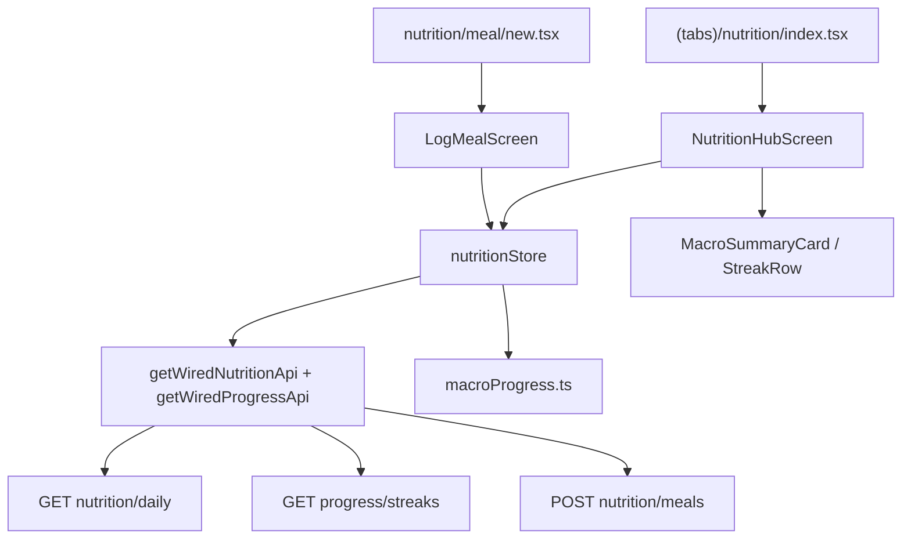

# Mobile Nutrition Design

**Spec**: `.specs/features/mobile-nutrition/spec.md`  
**Status**: Approved  
**Approach**: A — Zustand store + pure mappers + hub + meal log stack (mirrors `mobile-training`)

---

## Architecture

**Decision:** Approach **A** — `nutritionStore` + `macroProgress.ts` + `mealValidation.ts` + presentational components.



---

## Code Reuse

| Component | Location | Use |
|-----------|----------|-----|
| `Screen`, `PrimaryButton`, `TextField`, `LoadingState`, `InlineError` | `apps/mobile/src/ui/` | Hub + form |
| `useFormaTheme`, `useT` | theme + i18n | All screens |
| `createNutritionApi` | `apps/mobile/src/api/nutrition.ts` | Extend with `logMeal` |
| `getWiredProgressApi` | `wired.ts` | Streaks (already wired) |
| `DailySummary` type | `features/home/types.ts` | Reuse macro types |
| Training hub pattern | `TrainingHubScreen`, `trainingStore` | Hub layout, focus refresh, submit flow |

---

## Folder sketch

```
apps/mobile/
  app/(tabs)/nutrition/
    _layout.tsx          # Stack (hub + meal/new)
    index.tsx            # NutritionHubScreen
    meal/new.tsx         # LogMealScreen
  src/features/nutrition/
    nutritionStore.ts
    types.ts
    macroProgress.ts
    mealValidation.ts
    NutritionHubScreen.tsx
    LogMealScreen.tsx
    components/
      MacroSummaryCard.tsx
      MacroRow.tsx
      MealTypePicker.tsx
      MealItemForm.tsx
    __tests__/
      macroProgress.test.ts
      mealValidation.test.ts
  src/api/nutrition.ts   # + logMeal
  src/api/wired.ts       # + getWiredNutritionApi
```

Delete `app/(tabs)/nutrition.tsx` (replaced by folder).

---

## Macro progress mapper

```typescript
// macroProgress.ts
export type MacroKey = 'calories' | 'protein' | 'carbs' | 'fat';

export function macroProgress(consumed: number, target: number | null | undefined): number {
  if (target == null || target <= 0) return 0;
  return Math.min(consumed / target, 1);
}

export function formatMacroValue(consumed: number, target: number | null | undefined): {
  primary: string;
  secondary?: string;
} // consumed only or "consumed / target"
```

---

## i18n keys (`nutrition.*`)

| Key | en | pt-BR |
|-----|-----|-------|
| `nutrition.title` | Nutrition | Nutrição |
| `nutrition.hub.streak` | Streak: {{count}} | Sequência: {{count}} |
| `nutrition.hub.logMeal` | Log meal | Registrar refeição |
| `nutrition.hub.empty` | No meals logged today | Nenhuma refeição hoje |
| `nutrition.hub.noTarget` | No target set | Sem meta definida |
| `nutrition.macros.calories` | Calories | Calorias |
| `nutrition.macros.protein` | Protein | Proteína |
| `nutrition.macros.carbs` | Carbs | Carboidratos |
| `nutrition.macros.fat` | Fat | Gordura |
| `nutrition.meal.title` | Log meal | Registrar refeição |
| `nutrition.meal.save` | Save meal | Salvar refeição |
| `nutrition.meal.type.*` | breakfast/lunch/dinner/snack | café/almoco/jantar/lanche |
| `nutrition.fields.name` | Food name | Nome do alimento |
| `nutrition.fields.calories` | Calories | Calorias |
| `nutrition.validation.*` | required, min items | ... |
| `nutrition.errors.upgrade_required` | Daily meal limit reached | Limite diário atingido |

---

## Navigation

- Hub CTA → `router.push('/(tabs)/nutrition/meal/new')`
- After successful log → `router.back()` + hub `useFocusEffect` refresh

---

## Error handling

- `402` + `billing.upgrade_required` → `nutrition.errors.upgrade_required`
- Other API errors → `mapApiError`
- Partial hub failure: streak error inline; daily summary error blocks macro card
