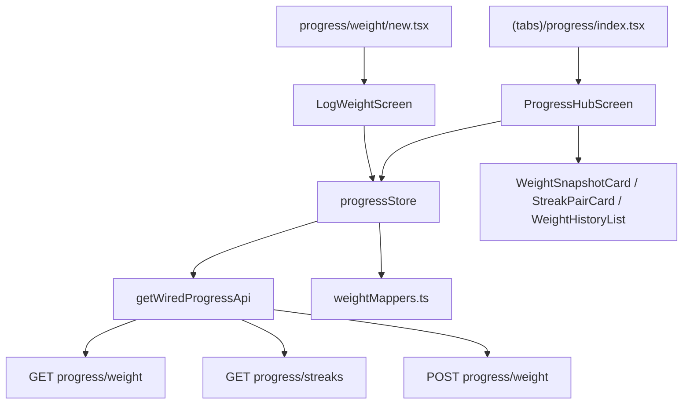

# Mobile Progress Design

**Spec**: `.specs/features/mobile-progress/spec.md`  
**Status**: Approved  
**Approach**: A — Zustand store + pure mappers + hub + log-weight stack (mirrors `mobile-nutrition`)

---

## Architecture Overview

**Decision:** Approach **A** — `progressStore` + `weightMappers.ts` + `weightValidation.ts` + presentational components. No chart library; list-based history.



---

## Code Reuse Analysis

### Existing Components to Leverage

| Component | Location | How to Use |
|-----------|----------|------------|
| `Screen`, `PrimaryButton`, `TextField`, `LoadingState`, `InlineError` | `apps/mobile/src/ui/` | Hub + log form |
| `useFormaTheme`, `useT` | theme + i18n | All screens |
| `createProgressApi` | `apps/mobile/src/api/progress.ts` | Extend with `logWeight`, `getWeightHistory` |
| `getWiredProgressApi` | `wired.ts` | Already wired; reuse in store |
| `StreaksResponse`, `StreakPair` | `features/home/types.ts` | Streak blocks |
| `todayUtcDate` | `features/home/summaryMappers.ts` | Today + range helpers |
| Nutrition hub pattern | `NutritionHubScreen`, `nutritionStore` | Parallel fetch, focus refresh, partial errors |
| `mapApiError` | `api/mapApiError.ts` | API error copy |

### Integration Points

| System | Integration Method |
|--------|-------------------|
| Progress API | `GET/POST /api/progress/weight`, `GET /api/progress/streaks` |
| Home Summary | No changes; tiles already read streaks independently |
| Training slice | Rest-day UI stays in Training; Progress only displays streak counts |

---

## Folder Sketch

```
apps/mobile/
  app/(tabs)/progress/
    _layout.tsx           # Stack (hub + weight/new)
    index.tsx             # ProgressHubScreen
    weight/new.tsx        # LogWeightScreen
  src/features/progress/
    progressStore.ts
    types.ts
    weightMappers.ts
    weightValidation.ts
    ProgressHubScreen.tsx
    LogWeightScreen.tsx
    components/
      WeightSnapshotCard.tsx
      TrendBadge.tsx
      StreakPairCard.tsx
      WeightHistoryRow.tsx
      WeightHistoryList.tsx
    __tests__/
      weightMappers.test.ts
      weightValidation.test.ts
  src/api/progress.ts     # + logWeight, getWeightHistory
```

Delete `app/(tabs)/progress.tsx` (replaced by folder).

---

## Components

### progressStore (Zustand)

- **Purpose**: Hub fetch, weight log submit, loading/error state per AD-030
- **Location**: `apps/mobile/src/features/progress/progressStore.ts`
- **Interfaces**:
  - `fetchHub(): Promise<void>` — parallel `getWeightHistory(range)` + `getStreaks()`
  - `logWeight(input: LogWeightInput): Promise<void>` — POST then `fetchHub()`
  - State: `weightEntries`, `streaks`, `todayUtc`, `hubLoading`, `hubErrors`, `submitLoading`, `submitError`
- **Dependencies**: `getWiredProgressApi`, `mapApiError`, mappers for default range
- **Reuses**: `nutritionStore` fetch generation pattern (`hubFetchGeneration`)

### weightMappers.ts

- **Purpose**: Pure transforms for latest weight, trend, history rows with deltas
- **Location**: `apps/mobile/src/features/progress/weightMappers.ts`
- **Interfaces**:
  - `defaultHistoryRange(today?: string): { from: string; to: string }` — 90-day window
  - `sortWeightEntries(entries): WeightEntry[]` — ascending by `logDate`
  - `latestWeight(entries): WeightEntry | null`
  - `computeWeightTrend(entries): 'up' | 'down' | 'stable' | null` — null when < 2 entries; thresholds ±0.2 kg
  - `buildHistoryRows(entries): WeightHistoryRowModel[]` — newest-first with signed delta vs chronologically previous
  - `formatWeightKg(value: number): string` — one decimal
- **Reuses**: `todayUtcDate` from home mappers

### weightValidation.ts

- **Purpose**: Client validation for log form
- **Interfaces**:
  - `validateLogWeight(input, messages): FieldErrors`
  - Rules: required weight, parse decimal (comma → dot), 0–500 kg, ISO date, not future, within 365 days past

### ProgressHubScreen

- **Purpose**: Main Progress tab surface
- **Layout order**: title → date → weight snapshot + trend → streak pair cards → history list → green CTA “Log weight”
- **testID**: `progress-screen`, `progress-retry-button`, `progress-log-weight-button`
- **Accent**: Stand cyan `#1EE4E1` on weight/trend chrome (per DESIGN.md)

### LogWeightScreen

- **Purpose**: Weight + date form
- **Fields**: `weightKg` (TextField), `date` (TextField `YYYY-MM-DD` default today)
- **testID**: `progress-weight-screen`, `progress-weight-input`, `progress-date-input`, `progress-weight-submit`
- **On success**: `router.back()`; hub refreshes via `useFocusEffect`

---

## Data Models

```typescript
// types.ts
export type WeightEntry = {
  id: string;
  userId: string;
  weightKg: number;
  logDate: string; // ISO date from API (slice 0,10)
  createdAt: string;
  updatedAt: string;
};

export type LogWeightInput = {
  weightKg: number;
  date: string;
};

export type WeightHistoryRowModel = {
  id: string;
  date: string;
  weightLabel: string;
  deltaLabel?: string; // e.g. "−0.5 kg"
  deltaPositive?: boolean;
};

export type WeightTrend = 'up' | 'down' | 'stable';
```

**Relationships**: Reuses `StreaksResponse` from `home/types.ts` — no new streak types.

---

## i18n Keys (`progress.*`)

| Key | en | pt-BR |
|-----|-----|-------|
| `progress.title` | Progress | Progresso |
| `progress.hub.logWeight` | Log weight | Registrar peso |
| `progress.hub.latestWeight` | Latest weight | Peso atual |
| `progress.hub.noWeight` | No weight logged | Nenhum peso registrado |
| `progress.hub.trend.up` | Trending up | Em alta |
| `progress.hub.trend.down` | Trending down | Em queda |
| `progress.hub.trend.stable` | Stable | Estável |
| `progress.hub.trend.insufficient` | Log at least two entries to see trend | Registre pelo menos dois pesos para ver a tendência |
| `progress.hub.recentWeight` | Recent weight | Peso recente |
| `progress.hub.emptyHistory` | Log your first weight to start tracking | Registre seu primeiro peso para começar |
| `progress.streak.training` | Training streak | Sequência de treino |
| `progress.streak.nutrition` | Nutrition streak | Sequência de nutrição |
| `progress.streak.current` | Current: {{count}} | Atual: {{count}} |
| `progress.streak.longest` | Best: {{count}} | Recorde: {{count}} |
| `progress.streak.zeroHint` | Keep your habit going | Mantenha o hábito |
| `progress.weight.title` | Log weight | Registrar peso |
| `progress.weight.save` | Save weight | Salvar peso |
| `progress.fields.weightKg` | Weight (kg) | Peso (kg) |
| `progress.fields.date` | Date | Data |
| `progress.validation.weightRequired` | Enter your weight | Informe o peso |
| `progress.validation.weightInvalid` | Enter a valid number | Número inválido |
| `progress.validation.weightRange` | Weight must be between 0 and 500 kg | Peso entre 0 e 500 kg |
| `progress.validation.dateRequired` | Enter a date | Informe a data |
| `progress.validation.dateInvalid` | Use YYYY-MM-DD | Use AAAA-MM-DD |
| `progress.validation.dateFuture` | Date cannot be in the future | Data não pode ser futura |
| `progress.validation.dateTooOld` | Date is too far in the past | Data muito antiga |

---

## Error Handling Strategy

| Error Scenario | Handling | User Impact |
|----------------|----------|-------------|
| Weight history fetch fails | `hubErrors.weight`; weight section inline error | Streaks still visible if loaded |
| Streaks fetch fails | `hubErrors.streaks`; streak section inline error | Weight section still visible |
| Both fail on first load | Full-screen error + retry | Loading skeleton first |
| Log weight validation | Inline field errors | Submit blocked |
| Log weight API error | `submitError` on form | `mapApiError` message |
| 401 | Session gate (existing) | Redirect to auth |

---

## Risks & Concerns

| Concern | Location | Impact | Mitigation |
|---------|----------|--------|------------|
| `progress.ts` missing weight methods | `api/progress.ts` | Hub cannot fetch/log | T1 extends client first |
| API `logDate` serialization | Prisma JSON | Parse/sort bugs | Normalize to `slice(0,10)` in mappers |
| No native DatePicker | Expo web | Clunky date UX | ISO text field + validation; P2 picker |
| Duplicate streak fetch | Home + Progress tabs | Extra API calls | Acceptable MVP; shared cache P2 |
| Placeholder tab file | `(tabs)/progress.tsx` | Route conflict | Delete in T10 when stack lands |

---

## Tech Decisions

| Decision | Choice | Rationale |
|----------|--------|-----------|
| History UI | Sorted list + delta | Spec out-of-scope for charts |
| Trend computation | Client-side ±0.2 kg | Matches `ProgressService.getWeightTrend` |
| Date input | TextField `YYYY-MM-DD` | No date picker dep; works on web E2E |
| History range | 90 days default | Spec assumption; single query |
| Store pattern | Zustand `progressStore` | AD-030 consistency |
