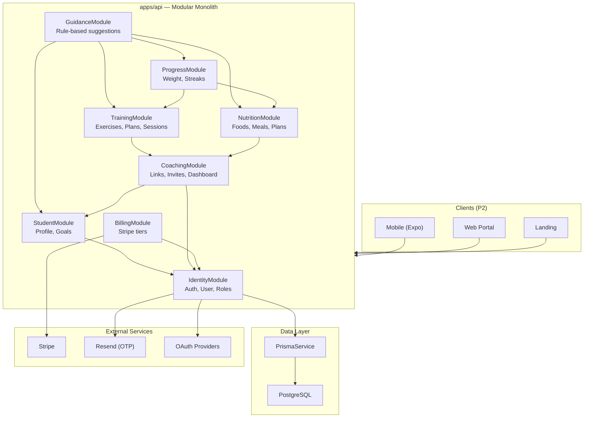

# Platform Foundation — Design

> Lightweight design. **NO** repository interfaces, **NO** domain/application/infrastructure layers, **NO** CQRS. NestJS module per bounded context with service + controller + DTOs.

## Executive Summary

Forma is a health/training/nutrition platform connecting Students to Professionals (trainers, nutritionists). The MVP is a **simple modular monolith**: one NestJS app (`apps/api`) with modules mapped to bounded contexts. Prisma is the data layer (used directly in services). Cross-module reads use exported services; side effects use NestJS `EventEmitter`.

---

## Bounded Contexts Map

### Domain Analysis (DDD Strategic Design)

| Context | Type | Ubiquitous Language | Business Capability | Cohesion |
|---------|------|---------------------|---------------------|----------|
| **Identity** | Generic | User, sessão, OTP, papel (role) | Autenticação e identidade | 9/10 |
| **Student** | Supporting | StudentProfile, onboarding, meta de saúde | Perfil e objetivos do aluno | 8/10 |
| **Guidance** | Supporting | sugestão, orientação, regra | Recomendações baseadas em meta | 7/10 |
| **Training** | **Core** | exercício, treino, série, plano de treino | Prescrição e registro de treino | 9/10 |
| **Nutrition** | **Core** | refeição, macro, alimento, plano nutricional | Prescrição e registro alimentar | 9/10 |
| **Progress** | Supporting | peso, streak, histórico | Acompanhamento de evolução | 8/10 |
| **Coaching** | **Core** | vínculo, convite, aluno vinculado, dashboard | Relação profissional-aluno | 8/10 |
| **Billing** | Generic | plano, assinatura, tier, checkout | Monetização Stripe | 7/10 |

**Core Domains:** Training, Nutrition, Coaching — competitive advantage.
**Supporting:** Student, Guidance, Progress — enable core loops.
**Generic:** Identity, Billing — standard infrastructure.

### Cross-Domain Cohesion Matrix

| Domain A | Domain B | Cohesion | Integration |
|----------|----------|----------|-------------|
| Identity | Student | 6/10 | Student module imports Identity exports (userId) |
| Student | Guidance | 9/10 | Guidance reads Student goal + activity data |
| Training | Progress | 8/10 | Progress listens to `training.session.completed` event |
| Nutrition | Progress | 8/10 | Progress listens to `nutrition.meal.logged` event |
| Coaching | Training | 7/10 | Coaching validates link; Training checks via CoachingService |
| Coaching | Nutrition | 7/10 | Same pattern |
| Billing | Identity | 5/10 | Billing stores subscription on User; Identity exposes tier check |

---

## Module Structure

Each bounded context maps to one NestJS module:

```
apps/api/src/modules/[context]/
  [context].module.ts       # NestJS module (imports, exports)
  [context].controller.ts   # REST endpoints
  [context].service.ts      # Business logic + Prisma calls
  dto/
    create-*.dto.ts         # class-validator input DTOs
    *-response.dto.ts       # Response shapes (optional)
  events/                   # Only if module emits events
    [context].events.ts
```

**Explicitly NOT included:**
- `domain/` layer with entities and repository interfaces
- `application/` layer with command/query handlers
- `infrastructure/` layer with repository implementations
- CQRS buses

**When to add `entities/`:** Only if Prisma types need computed properties or domain methods that don't belong in service. Default: use Prisma generated types directly.

### Module Registry

| Module | Path | Exports | Depends On |
|--------|------|---------|------------|
| `IdentityModule` | `modules/identity/` | `IdentityService`, `AuthGuard` | PrismaModule |
| `StudentModule` | `modules/student/` | `StudentService` | IdentityModule |
| `GuidanceModule` | `modules/guidance/` | `GuidanceService` | StudentModule, TrainingModule, NutritionModule, ProgressModule |
| `TrainingModule` | `modules/training/` | `TrainingService` | IdentityModule, CoachingModule |
| `NutritionModule` | `modules/nutrition/` | `NutritionService` | IdentityModule, CoachingModule |
| `ProgressModule` | `modules/progress/` | `ProgressService` | IdentityModule |
| `CoachingModule` | `modules/coaching/` | `CoachingService` | IdentityModule, StudentModule |
| `BillingModule` | `modules/billing/` | `BillingService` | IdentityModule |

### Shared Infrastructure (not bounded contexts)

```
apps/api/src/
  prisma/                   # PrismaModule + PrismaService (global)
  health/                   # Health checks (existing)
  common/                   # Guards, filters, pipes, decorators
    auth.guard.ts
    roles.decorator.ts
    http-exception.filter.ts
```

---

## Prisma Schema Organization

Single schema file (`prisma/schema.prisma`) with table prefixes per module:

```prisma
// Identity
model IdentityUser { ... @@map("identity_users") }
model IdentityOtpToken { ... @@map("identity_otp_tokens") }
model IdentitySession { ... @@map("identity_sessions") }

// Student
model StudentProfile { ... @@map("student_profiles") }
model StudentHealthGoal { ... @@map("student_health_goals") }

// Training (MVP: user-owned custom exercises — no seeded library)
model TrainingExercise { ... @@map("training_exercises") }
model TrainingWorkoutPlan { ... @@map("training_workout_plans") }
model TrainingWorkoutSession { ... @@map("training_workout_sessions") }

// Nutrition (MVP: manual macro entry — no food database)
model NutritionMealLog { ... @@map("nutrition_meal_logs") }
model NutritionMealItem { ... @@map("nutrition_meal_items") }
model NutritionPlan { ... @@map("nutrition_plans") }

// Progress
model ProgressWeightEntry { ... @@map("progress_weight_entries") }
model ProgressStreak { ... @@map("progress_streaks") }

// Coaching
model CoachingProfessionalProfile { ... @@map("coaching_professional_profiles") }
model CoachingInvite { ... @@map("coaching_invites") }
model CoachingLink { ... @@map("coaching_links") }

// Billing
model BillingSubscription { ... @@map("billing_subscriptions") }
model BillingPlan { ... @@map("billing_plans") }
```

**Ownership rule:** Each module's service accesses only its prefixed tables. Cross-module reads go through exported services, not direct Prisma queries on foreign tables.

---

## Cross-Module Communication

### Sync (preferred for reads)

```typescript
// coaching.module.ts
@Module({
  imports: [IdentityModule, StudentModule],
  exports: [CoachingService],
})
export class CoachingModule {}

// training.service.ts
constructor(
  private prisma: PrismaService,
  private coaching: CoachingService,  // injected via module import
) {}

async prescribePlan(studentId: string, professionalId: string) {
  await this.coaching.assertLinked(professionalId, studentId);
  // ... create plan
}
```

### Async (for side effects)

```typescript
// training.service.ts
this.eventEmitter.emit('training.session.completed', { userId, date });

// progress.service.ts — @OnEvent('training.session.completed')
async handleSessionCompleted(payload) {
  await this.updateStreak(payload.userId, 'training', payload.date);
}
```

**No** message bus, **no** event sourcing, **no** outbox pattern in MVP.

---

## Monorepo Folder Structure

```
forma/
├── apps/
│   ├── api/                    # NestJS REST API (MVP focus)
│   ├── worker/                 # BullMQ (local only, not deployed)
│   ├── mobile/                 # Expo React Native (P2)
│   ├── web-portal/             # React — professionals (P2)
│   └── web-landing/            # React — marketing (P2)
├── packages/
│   ├── types/                  # Shared TypeScript types/enums
│   │   ├── src/
│   │   │   ├── roles.ts        # Role enum, HealthGoal enum, etc.
│   │   │   └── index.ts
│   │   ├── package.json
│   │   └── tsconfig.json
│   └── config/                 # Shared config (eslint, tsconfig base)
│       ├── eslint/
│       ├── tsconfig/
│       └── package.json
├── prisma/
│   ├── schema.prisma
│   └── migrations/
├── docker/
├── .specs/
├── turbo.json
├── pnpm-workspace.yaml
└── render.yaml
```

---

## Architecture Diagram



---

## API Conventions

| Convention | Value |
|------------|-------|
| Base path | `/api` |
| Module prefix | `/api/[context]` (e.g., `/api/identity`, `/api/training`) |
| Auth | Bearer JWT in `Authorization` header |
| Validation | `class-validator` + global `ValidationPipe` |
| Docs | `@nestjs/swagger` decorators on controllers |
| Errors | Consistent `{ statusCode, message, error }` via global filter; **localized** per `Accept-Language` |
| i18n | `pt-BR` (default) and `en` — see Internationalization section |
| Pagination | `?page=1&limit=20` query params |
| IDs | CUID (Prisma default) |

---

## Key Endpoints (MVP)

| Method | Path | Module | Description |
|--------|------|--------|-------------|
| POST | `/api/identity/otp/request` | Identity | Request email OTP (Resend prod / mock dev) |
| POST | `/api/identity/otp/verify` | Identity | Verify OTP → JWT |
| GET | `/api/identity/oauth/:provider` | Identity | Start OAuth flow (google, apple, facebook) |
| GET | `/api/identity/oauth/:provider/callback` | Identity | OAuth callback → JWT |
| GET | `/api/identity/me` | Identity | Current user + roles |
| POST | `/api/student/profile` | Student | Create StudentProfile |
| PUT | `/api/student/goal` | Student | Set health goal |
| GET | `/api/guidance/daily` | Guidance | Daily suggestions |
| GET | `/api/training/exercises` | Training | List user's custom exercises |
| POST | `/api/training/exercises` | Training | Create custom exercise |
| POST | `/api/training/plans` | Training | Create workout plan |
| POST | `/api/training/sessions` | Training | Log workout session |
| GET | `/api/training/sessions` | Training | Session history |
| POST | `/api/nutrition/meals` | Nutrition | Log meal with manual macro values |
| GET | `/api/nutrition/daily` | Nutrition | Daily macro summary |
| POST | `/api/nutrition/plans` | Nutrition | Prescribe nutrition plan |
| POST | `/api/progress/weight` | Progress | Log weight |
| GET | `/api/progress/weight` | Progress | Weight history |
| GET | `/api/progress/streaks` | Progress | Current/longest streaks |
| POST | `/api/coaching/profile` | Coaching | Create professional profile |
| POST | `/api/coaching/invites` | Coaching | Send student invite |
| POST | `/api/coaching/invites/:token/accept` | Coaching | Accept invite |
| GET | `/api/coaching/dashboard` | Coaching | Professional dashboard |
| GET | `/api/billing/plans` | Billing | List tiers |
| POST | `/api/billing/checkout` | Billing | Start Stripe checkout |
| POST | `/api/billing/webhook` | Billing | Stripe webhook |

---

## Internationalization (i18n)

**Approach:** Lightweight JSON locale files — no heavy framework dependency.

```
apps/api/src/i18n/
  locales/
    pt-BR.json
    en.json
  i18n.service.ts      # resolve(key, lang) → string
  i18n.module.ts
```

- **Default locale:** `pt-BR`
- **Resolution:** `Accept-Language` header → `pt-BR` or `en` (fallback `pt-BR`)
- **Scope:** API error messages, validation messages, billing/upgrade hints, guidance suggestions
- **Usage:** `I18nService.t('errors.otp_expired', lang)` in services and exception filter
- **Shared keys:** Validation messages can reference i18n keys in DTO decorators where practical

`nestjs-i18n` is optional if needs grow; start with a simple `I18nService` + JSON files to avoid ceremony (AD-001).

---

## Identity — Email OTP (Resend)

```
apps/api/src/modules/identity/
  email/
    email.module.ts
    resend-email.provider.ts   # production — RESEND_API_KEY env
    mock-email.provider.ts     # dev/test — logs OTP to console
```

- **Interface:** `EmailProvider.sendOtp(to, code)` — swap via env (`EMAIL_PROVIDER=resend|mock`)
- **Resend:** single transactional email per OTP request; template in pt-BR/en based on request locale
- **Failure:** provider error → `503 Service Unavailable` (no OTP leaked)

---

## Identity — OAuth (P1)

- Passport strategies: `passport-google-oauth20`, `passport-apple`, `passport-facebook`
- Flow: redirect → provider → callback → upsert `IdentityUser` + link `IdentityOAuthAccount` → JWT
- Same JWT/session model as OTP — unified auth guard

---

## Billing — Entitlement Check Pattern

```typescript
// billing.service.ts
async assertEntitlement(userId: string, feature: EntitlementFeature): Promise<void> {
  const sub = await this.getActiveSubscription(userId);
  if (!this.hasFeature(sub, feature)) {
    throw new PaymentRequiredException('billing.upgrade_required', { upgradeUrl: '...' });
  }
}

// Usage in coaching.service.ts
await this.billing.assertEntitlement(userId, 'professional_profile');

// Usage in nutrition (P2 AI endpoint)
await this.billing.assertEntitlement(userId, 'ai_food_recognition');
```

**Entitlement matrix (MVP):**

| Feature | free (student) | pro (student) | professional (paid) |
|---------|----------------|---------------|---------------------|
| Manual training/nutrition | ✅ | ✅ | N/A (professional uses coaching) |
| AI food recognition (P2) | ❌ | ✅ | N/A |
| Professional profile | ❌ | ❌ | ✅ (subscription required) |
| Coaching dashboard | ❌ | ❌ | ✅ |

**Guard option:** `@RequiresEntitlement('ai_food_recognition')` decorator wrapping `BillingService.assertEntitlement`.

---

## P2 Scope (documented, not MVP)

| Capability | Notes |
|------------|-------|
| Curated food database | Searchable foods with macros; optional TACO/USDA integration |
| Exercise video library | Pre-seeded exercises with instructional video URLs |
| AI food photo → macros | Async worker + vision model; gated by `BILL-02` Pro entitlement |

---

## Testing Strategy

- **Integration tests (e2e)** per module using Supertest + test database
- Tests assert spec acceptance criteria (WHEN/THEN), not implementation details
- One test file per module: `apps/api/test/[context].e2e-spec.ts`
- Test DB: separate `DATABASE_URL` for tests; migrations run in `beforeAll`
- No unit tests for services in MVP (integration covers routes + logic)

---

## Evolution Path

| Future need | Migration path |
|-------------|----------------|
| Async jobs (IA, WhatsApp) | Deploy `apps/worker` + Redis on Render |
| Extract module to microservice | Module already has clear boundary; move to own app |
| CQRS for complex reads | Add query handlers inside module (not global layer) |
| Multiple databases | Split Prisma schema by module prefix → separate datasources |

---

## Anti-Patterns to Avoid

- ❌ Repository interface + implementation for every entity
- ❌ Domain entities duplicating Prisma models
- ❌ CommandBus/QueryBus for simple CRUD
- ❌ Shared mutable state between modules
- ❌ Direct Prisma queries on another module's tables
- ❌ Generic entity names without prefix (`User` in billing context — use `BillingSubscription`)
