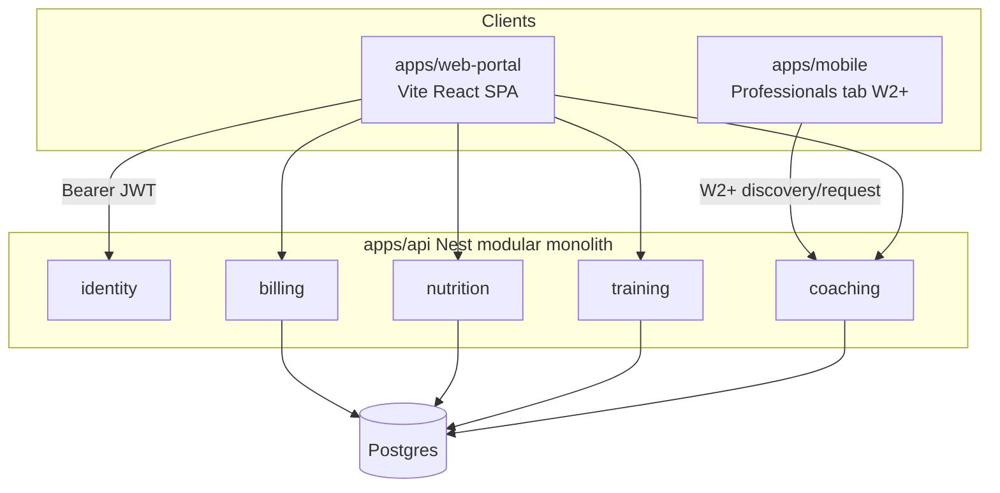
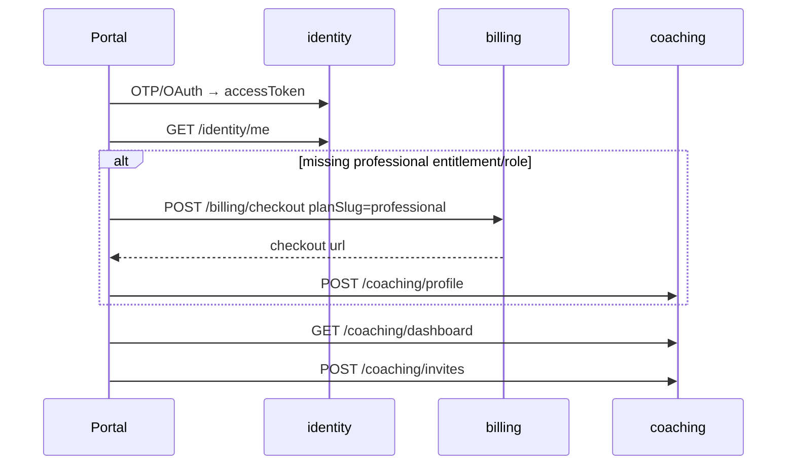

# Web Portal (Professionals) Design

**Spec**: `.specs/features/web-portal/spec.md`  
**Context**: `.specs/features/web-portal/context.md`  
**Status**: Approved  
**Approach**: **A** (recommended) — Vite SPA in monorepo + phased API extensions in Nest modules

---

## Approach exploration (Large)

| | **A — Vite SPA + Nest seams (recommended)** | **B — Portal shell + API stubs/flags** | **C — Shared `@forma/ui-web` first** |
|---|---------------------------------------------|----------------------------------------|-------------------------------------|
| Idea | `apps/web-portal` talks to existing `/api/*`; each phase adds real API + UI together | Ship empty portal routes early; feature-flag W2–W4 until backends land | Extract design-system package before any screen |
| Pros | Matches AD-001/AD-033; demoable per W*; same patterns as mobile clients | Faster “empty shell” on Render | Max token reuse long-term |
| Cons | Cross-cutting PRs (API+portal+sometimes mobile) | Fake UI risk; double work when unflagging | Ceremony before value; slows W1 |
| Fit | **Best** for phased large delivery | Weak for coaching product demos | Premature for v1 |

**Chosen: A.** User locked Vite SPA; W1 must be a real professional workplace against live coaching/billing APIs.

---

## Architecture Overview



**W1 runtime path**



---

## Code Reuse Analysis

### Existing to leverage

| Component | Location | How to use |
|-----------|----------|------------|
| OTP + OAuth + `/me` | `apps/api/src/modules/identity/` | Portal auth identical contract to mobile |
| Checkout | `POST /api/billing/checkout` + `planSlug` | W1 paywall; mock URL already in service |
| Coaching profile / invites / dashboard | `apps/api/src/modules/coaching/` | W1 core; extend for W2 public profile + requests |
| Nutrition prescribe | `POST /api/nutrition/plans` + `assertLinked` | W4 prescribe from templates; W1 unused |
| Mobile API client pattern | `apps/mobile/src/api/client.ts`, stores | Mirror thin `fetch` + Zustand in portal |
| Design tokens | `DESIGN.md`, `apps/mobile/src/theme/colors.ts` | Port CSS variables (pro-dashboard density) |
| Roles | `@forma/types` `Role` | Route guards in portal by `me.roles` |
| i18n pattern | API locales + mobile `en.ts`/`pt-BR.ts` | Portal dict `portal.*` keys |
| Render blueprint | `render.yaml` | Add static site service for portal |

### Integration points

| System | Method |
|--------|--------|
| API | `VITE_API_URL` + `Authorization: Bearer` |
| CORS | **Enable production CORS** for portal origin(s) via `CORS_ORIGIN` (today CORS is non-prod only — WPORT-19) |
| Stripe | Existing checkout; pricing copy deferred |
| Mobile W2 | New tab + coaching public/request APIs |
| Postgres | New tables for requests, templates, periodization (W2–W4); extend `CoachingProfessionalProfile` for public fields |

---

## Phase seams

| Phase | Portal | API | Mobile |
|-------|--------|-----|--------|
| **W1** | Scaffold, auth, paywall, onboarding, dashboard, invites | Prod CORS; optional profile bio fields if needed for onboarding | none |
| **W2** | Pending requests inbox; profile editor publish | Public profile read; coaching request CRUD + accept/decline | Professionals tab + profile + request CTA |
| **W3** | Template library + prescribe UI | Training templates; `POST` prescribe plan for `studentUserId` (role Trainer + `assertLinked`) | Student already lists own plans — ensure prescribed plans appear |
| **W4** | Nutrition templates + periodization builder | Nutrition templates; periodization models + assign/advance | Student sees active block plan |

Execute **one phase at a time**; Design below details **W1 fully** and contracts for later phases so Tasks can slice cleanly.

---

## Components (W1)

### `apps/web-portal` (package `@forma/web-portal`)

- **Purpose**: Professional workplace SPA
- **Location**: `apps/web-portal/`
- **Tooling**: Vite, React 19 (workspace override), TypeScript, React Router, Zustand, Biome via monorepo
- **Scripts**: `dev`, `build`, `preview`, `check-types`
- **Env**: `VITE_API_URL`, `VITE_OAUTH_SUCCESS_URL` (portal origin callback path)
- **Reuses**: Mobile auth/API idioms; not React Native components

### Folder sketch (W1)

```
apps/web-portal/
  index.html
  vite.config.ts
  package.json
  src/
    main.tsx
    app/
      App.tsx                 # Router + auth gate
      routes.tsx
    api/
      client.ts               # fetch + Bearer + Accept-Language
      identity.ts
      billing.ts
      coaching.ts
      wire.ts
    stores/
      sessionStore.ts
      localeStore.ts
      dashboardStore.ts
    features/
      auth/                   # OTP request/verify, OAuth buttons
      onboarding/             # checkout CTA + create profile form
      dashboard/              # roster table + empty/error
      invites/                # invite-by-email form
    ui/                       # Button, TextField, Page, InlineError, DataTable
    theme/
      tokens.css              # Forma CSS variables (desktop density)
      theme.ts
    i18n/
      en.ts
      pt-BR.ts
      index.ts
```

### Session & API client

```typescript
// sessionStore — parity with mobile AD-030
interface SessionState {
  accessToken: string | null
  me: { id: string; email: string; roles: string[] } | null
  restore(): Promise<void>      // localStorage
  setSession(token: string): Promise<void>
  clear(): void
  refreshMe(): Promise<void>
}

// api/client.ts
request<T>(path: string, init?: RequestInit): Promise<T>
// on 401 → clear session; map 402/403/410 to typed errors for UI CTAs
```

### Route map (W1)

| Path | Gate | Screen |
|------|------|--------|
| `/login` | public | Auth |
| `/onboarding` | authed, missing trainer/nutritionist | Checkout + profile |
| `/` | authed + pro role | Dashboard |
| `/invites` | authed + pro role | Invite form (+ optional history later) |

OAuth: prefer redirect back to portal with token query (reuse non-mobile JSON callback or dedicated `platform=web` if Design implementation needs it — **prefer extending oauth callback to support `platform=web` → redirect `VITE_OAUTH_SUCCESS_URL?accessToken=`** without inventing cookie auth).

### UI kit (pro dashboard × brand)

- Canvas: light **or** dark surface set derived from Forma tokens — **default light desktop dashboard** with green primary `#30D158`, dark optional via `prefers-color-scheme` later if cheap
- Density: table rows, compact filters later (P2); W1 = simple table + page header + primary CTA
- No Apple rings on portal; brand chrome + Exercise/Stand accents only where domain cues help
- Follow `.specs/ui/RULES.md` anti-patterns (no purple gradients, no card soup in heroes)

### Render

```yaml
# render.yaml addition (sketch)
- type: web
  name: forma-web-portal
  runtime: static
  buildCommand: pnpm --filter @forma/web-portal build
  staticPublishPath: apps/web-portal/dist
  routes:
    - type: rewrite
      source: /*
      destination: /index.html
  envVars:
    - key: VITE_API_URL
      sync: false
```

API service: set `CORS_ORIGIN` to portal URL(s).

---

## Components (W2–W4 contracts — not built in W1)

### W2 — Discovery & requests

**API (new)**

| Method | Path | Auth | Behavior |
|--------|------|------|----------|
| `GET` | `/api/coaching/professionals` | optional/student | Browse/search public pros |
| `GET` | `/api/coaching/professionals/:idOrSlug` | public | Public profile |
| `PATCH` | `/api/coaching/profile` | pro | Update bio, displayName, slug, published |
| `POST` | `/api/coaching/requests` | student | Create pending request |
| `GET` | `/api/coaching/requests` | pro | List pending for me |
| `POST` | `/api/coaching/requests/:id/accept` | pro | → CoachingLink |
| `POST` | `/api/coaching/requests/:id/decline` | pro | Close request |

**Data**

```prisma
// extend CoachingProfessionalProfile
displayName  String?
bio          String?
slug         String?  @unique
isPublished  Boolean  @default(false)

model CoachingLinkRequest {
  id                   String   @id @default(cuid())
  professionalUserId   String
  studentUserId        String
  status               String   // pending | accepted | declined | expired
  createdAt            DateTime @default(now())
  resolvedAt           DateTime?
  @@unique([professionalUserId, studentUserId, status]) // enforce pending uniqueness in service
  @@map("coaching_link_requests")
}
```

Pending TTL **30 days** → `expired` (spec assumption).

**Mobile**: `(tabs)/professionals` stack — list, detail, request button; Zustand `professionalsStore`.

### W3 — Training templates & prescribe

**API (new / extend)**

| Method | Path | Auth | Behavior |
|--------|------|------|----------|
| CRUD | `/api/training/templates` | Trainer | Owned templates |
| `POST` | `/api/training/plans/prescribe` | Trainer | `{ studentUserId, plan \| templateId }` + `assertLinked` |

Relax student-only guard on prescribe path only; student `POST /plans` remains self-serve.

**Data**: `TrainingWorkoutTemplate` (professionalUserId, name, exercises JSON mirroring plan structure).  
Prescribed `WorkoutPlan` rows gain optional `prescribedByUserId` + `studentUserId` ownership for the student (plan appears in student’s `GET /training/plans`).

### W4 — Nutrition templates & light periodization

**API**

| Method | Path | Auth | Behavior |
|--------|------|------|----------|
| CRUD | `/api/nutrition/templates` | Nutritionist | Macro targets + optional menu JSON |
| Prescribe from template | extend existing plans POST | Nutritionist + link | |
| CRUD | `/api/training/periodizations` | Trainer | Ordered blocks |
| `POST` | `.../periodizations/:id/assign` | Trainer | Link to student |
| `POST` | `.../assignments/:id/advance` | Trainer or system rule | Next block |

**Periodization advance rule (locked for Design)**: each block has `startsOn` / `endsOn` (UTC dates) **or** `durationDays`; active block = first whose window contains today; if past end and next exists, active advances on read (lazy) or explicit advance endpoint — **prefer lazy resolve on student plan fetch** + portal “Advance now” button.

```prisma
model TrainingPeriodization {
  id                 String @id @default(cuid())
  professionalUserId String
  name               String
  // blocks relation
}

model TrainingPeriodizationBlock {
  id               String @id @default(cuid())
  periodizationId  String
  position         Int
  workoutPlanId    String?  // or templateId resolved at assign
  templateId       String?
  durationDays     Int
}

model TrainingPeriodizationAssignment {
  id               String @id @default(cuid())
  periodizationId  String
  studentUserId    String
  startedOn        DateTime @db.Date
  activePosition   Int      @default(0)
}
```

---

## Error Handling Strategy

| Scenario | Handling | User impact |
|----------|----------|-------------|
| 401 | Clear token → `/login` | Re-auth |
| 402 on profile/coaching | Paywall with checkout CTA | Subscribe |
| 403 unlinked prescribe (W3+) | Toast + stay on student picker | No silent fail |
| 410 invite expired | Message + resend invite | Recover |
| Dashboard network fail | InlineError + Retry | Recover |
| Checkout URL missing | Error state | Support/retry |
| Duplicate pending request | 409 → friendly “already requested” | No dup rows |
| CORS fail (misconfig) | Visible network error | Ops fix `CORS_ORIGIN` |

---

## Risks & Concerns

| Concern | Location | Impact | Mitigation |
|---------|----------|--------|------------|
| Production CORS disabled | `apps/api/src/app.configure.ts:7-15` | Portal cannot call API in prod | W1 task: CORS when `CORS_ORIGIN` set, including production |
| Training prescribe gap | `training.controller.ts` `@Roles(Student)` only | W3 blocked without API work | Explicit W3 API tasks before portal prescribe UI |
| `coaching_dashboard` entitlement unused | billing seed vs routes | Pros without pay might use invites if role somehow set | Keep profile create 402-gated; optional W1 harden dashboard/invites with entitlement |
| OAuth web redirect | `oauth.controller.ts` mobile-oriented | Portal OAuth broken | Add `platform=web` redirect to portal success URL |
| Public profile PII leak | new W2 endpoints | Email/private data exposure | Public DTO whitelist only |
| Large phase scope creep | — | Missed demos | Hard phase gates; no W2 UI in W1 PRs |
| Stripe real vs mock | `billing.service.ts` | Checkout UX differs prod/dev | Portal handles external redirect URL generically |
| pnpm React overrides | root `package.json` | Portal React 19 forced | Accept; Vite React 19 supported |

---

## Tech Decisions (feature-local)

| Decision | Choice | Rationale |
|----------|--------|-----------|
| Router | React Router v7 | Standard SPA routing |
| Client state | Zustand | AD-030 parity |
| Token storage | `localStorage` | SPA; same tradeoffs as mobile web |
| Default theme | Light dashboard + Forma green | Pro workplace readability; dark later optional |
| W1 profile fields | type + credentials (+ optional displayName/bio stored even if unpublished until W2) | Avoid second migration for W2 basics |
| Periodization resolve | Lazy active-block on read + portal advance | Simple; no worker (AD-005) |
| Shared UI package | **Not in W1** | Approach A; extract later if duplication hurts |
| Tests W1 | API e2e unchanged + Playwright smoke on portal auth→dashboard (optional if heavy) | Prefer Vitest for pure mappers; portal smoke mirrors mobile AD-031 spirit |
| Package name | `@forma/web-portal` | Match apps naming |

### Project-level (already / to append)

| ID | Decision |
|----|----------|
| AD-033 | Vite SPA + Render |
| AD-034 | Invite + request |
| AD-035 | Phases W1–W4 |
| AD-036 | Light periodization |
| AD-037 | Pro dashboard × Forma brand |
| AD-039 *(new)* | **Production API CORS** via `CORS_ORIGIN` allowlist (not “dev only”) so browser clients (portal) work | 2026-07-12 |

---

## W1 success slice (Design → Tasks input)

1. Scaffold `@forma/web-portal` + turbo/workspace + Render static service  
2. API: production CORS + OAuth `platform=web` redirect  
3. Portal auth (OTP + OAuth) + session  
4. Onboarding: checkout professional + create profile  
5. Dashboard against `GET /coaching/dashboard`  
6. Invite form against `POST /coaching/invites`  
7. i18n pt-BR/en + Forma tokens CSS  
8. Gates: `check-types`, lint scope, API e2e still green; portal smoke if added  

---

## Confirm

Confirm this design (Approach **A** + W1 detail + W2–W4 contracts). Next: **Tasks** breakdown (phase-batched, ~W1 first executable batch).
